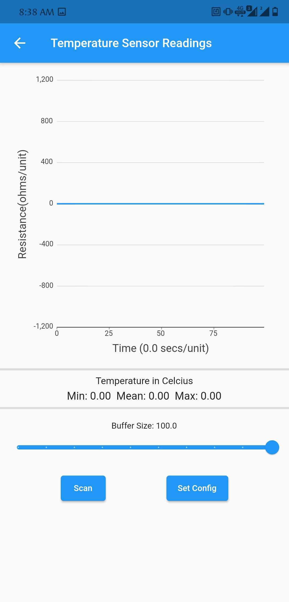
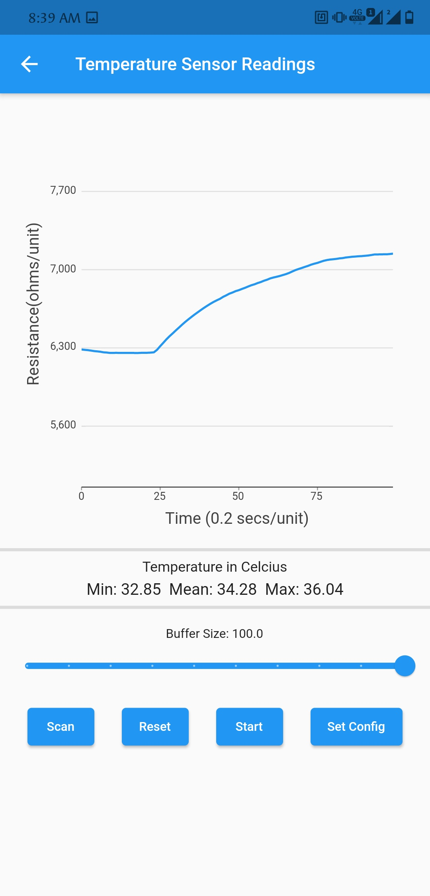
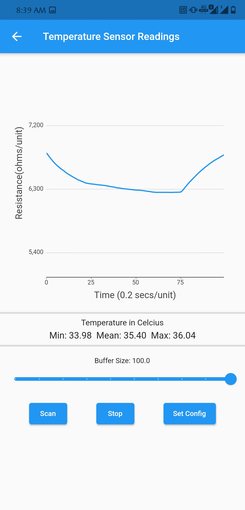
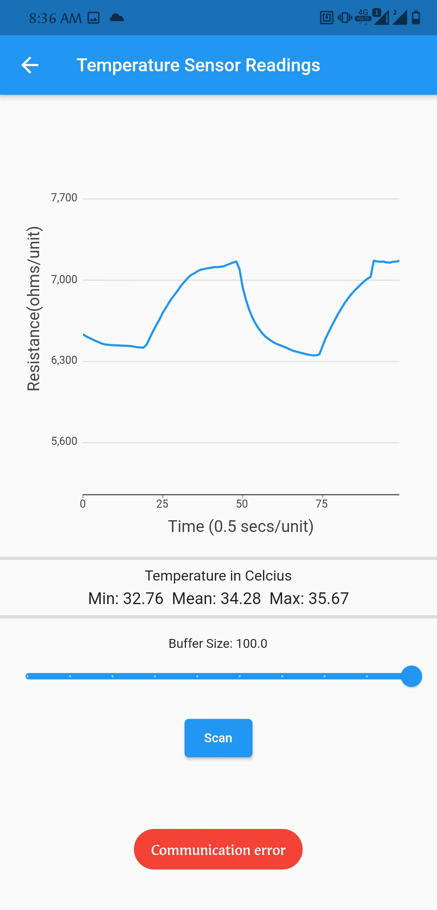

# SIC4340 NFC Sensor Patch App

## Introduction

This App was built to use with the SIC4340 NFC tag chip which has 3 ADC channels for measuring voltage of numerous sensors. Also, The chip has Constant current source with programmable current. This helps to readily measure resistance of resistive sensors.

## How To Use

### Step 1: Turn On NFC and select sensor type

The apps starting screen is a select screen where the user is able to select one of three sensor types listed below:

* Pulse Sensor
* Temperature
* Light sensor

The choice to select the ssensor type is given only if NFC is turned on.

Sensor Select Screen: NFC off                  |  Sensor Select Screen: NFC on
:-------------------------:|:-------------------------:
{width=200px} | {width=200px}

#### Pulse Sensor

This mode is designed for [pulse sensor](https://pulsesensor.com/) which is connected to ***S1*** channel of SIC4340. It displays Voltage vs Time graph and Beats Per Minute(BPM).

#### Temperature Sensor

This mode is designed for negative thermal co-efficient thermistor. The thermistor is connected between ***S2*** and ***GND***. A constant current is passed through the thermistor from DAC and volatge is measured from ADC, then resistance is computed using ohms law. The Temperature is computed by using [Steinhart–Hart equation](https://en.wikipedia.org/wiki/Steinhart%E2%80%93Hart_equation) and plotted against time as a graph. Few statistics such as minimum, maximum and mean values are also displayed.

#### Light Sensor

This mode is designed for a photo sensor whose voltage is dependent on amount of light incident on it. The Voltage vs TIme graph and few stastics like minimum, maximum and average voltage values are also displayed.

### Step 2: Scan and set config

Sensor Screen: Before Scanning  |  Sensor Screen: Scan Timeout  |  Sensor Screen: After Scanning
:-------------------------:|:-------------------------:|:-------------------------:
{width=200px} | {width=200px}| {width=200px}

After selecting the sensor you are taken to respective sensor scan where you can view graph and few parameters displayed. Also there is an option to change buffer size. The buffer size corresponds to the size of the X-axis of the graph.

A scan button will be displayed at the bottom. The NFC tag should be bought into vicinity of the phone only after pressing the scan button. There is a timeout of 10 seconds for scanning, after which an error message pops up if no tag is detected.

After the scan is succesful, a new set config button appears next to the scan button. Upon pressing this button you will be taken to configuration screen. In this screen you will be able to configure ADC and DAC parameters. The default parameters are already set for the respective sensors in the app. The set button at the bottom of the screen updates these settings to the chip by sending required NFC commands.

Configuration Screen  |  Sensor Screen: After Setting Configuration  
:-------------------------:|:-------------------------:
{width=200px} | {width=200px}

### Step 3: Start/Stop and Reset

After setting the configuration, the sensor screen will be updated with two new buttons reset and start. The ADC will begin sampling after clicking start. Once this process begins the start and reset buttons are removed and stop button is displayed. The stop will stop the sampling process. The reset button will reset the graph to initial condition. If the tag is out of range or if there is any error in communication, an error message pops up.

Sensor Screen: After Starting  |  Sensor Screen: After Stopping  |  Sensor Screen: Communication error
:-------------------------:|:-------------------------:|:-------------------------:
{width=200px} | {width=200px} | {width=200px}

The apk file of the app is available in the folder apk, for more information about the sic4340 and code visit the wiki page.
